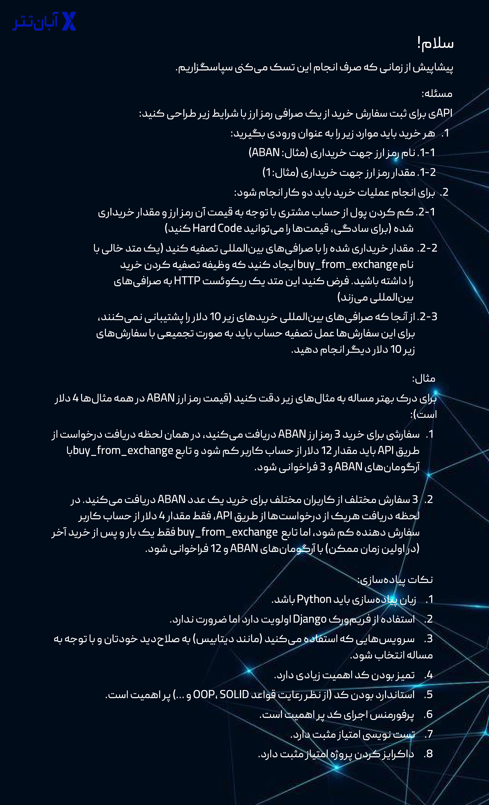

# Abantether Crypto Pseudo App
> 

# How to setup the local development environment?
First, install [**pyenv**](https://github.com/pyenv/pyenv#installation) and [**Poetry**](https://github.com/python-poetry/poetry#installation) from their sources, as the current repository depends on it, then follow the instructions below:

```bash
# change directory to the project's root.
cd .../aban-crypto-pseudo-app

# set the required python version, as a variable.
export PYTHON_VERSION=`head -1 .python-version`

# install the required python version, if not already exist.
pyenv install $PYTHON_VERSION

# activate the poetry shell.
poetry env use $PYTHON_VERSION && \
poetry shell

# install the project's requirements.
poetry update
```

# How to add/remove/update the project dependencies?
The project dependencies are managed by [**Poetry**](https://github.com/python-poetry/poetry#installation) (relates to `pyproject.toml` file), an innovative packaging and dependency management for Python. Refer to the Poetry [**documentation**](https://python-poetry.org/docs/) for future details on how to [**add**](https://python-poetry.org/docs/cli/#add)/[**remove**](https://python-poetry.org/docs/cli/#add)/[**update**](https://python-poetry.org/docs/cli/#update) the project dependencies.

To re-generate `requirements.txt` and `development.txt` files follow the instructions below (**DO NOT** manipulate the files by hand!):

```bash
make requirements
```

# How to add/remove/update the project settings?
The settings are managed by [**Dynaconf**](https://dynaconf.com/) (relates to `settings.toml` file), an innovative configuration management for Python applications. Refer to the Dynaconf [**documentation**](https://www.dynaconf.com/) for future details on how to add/remove/update the project settings.

All keys presented in the `settings.toml` file can be overridden by `system environment variables` or defining a multi-environment `.secrets.toml` or `settings.local.toml` file in the project root. To avoid pollution or potential loading of sensitive information, blind loading of all system environment variables into the app settings is **disabled** by default. Due to this reason, the `global` section in the `settings.toml` file keeps all secret variables that are required by the app, in order to be able to overwrite them later with the methods mentioned above. In a nutshell:
- Each section in the configuration files represents an environment for the app.
- `default` section settings are shared between all other sections unless they are overridden (reserved name).
- `global` section settings are used when a key does not exist in the requested environment (reserved name).
- The settings of all other sections are environment specific.

# How to switch between the app environments?
To switch flawlessly between app environments, use the `ENVIRONMENT` variable as follow:

```bash
# Dynamically set the variable on the fly.
ENVIRONMENT=development <COMMAND (e.g. python fastapi ...)>
```
OR
```bash
# Export the variable in the shell.
export ENVIRONMENT=development
<COMMAND (e.g. python fastapi)>
```

Also you can use `Makefile` predefined targets:
```bash
<COMMAND (e.g. make run ENVIRONMENT=development)>
```

# How to test the final changes on an isolated local environment before pushing?
Follow the instructions below:

```bash
docker compose up --remove-orphans --build --force-recreate
```
